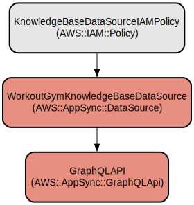

# FitTrack - Your Personal AI-Powered Workout Assistant

FitTrack is a modern web application that helps users track their workouts, get personalized fitness advice, and achieve their fitness goals. Built with Next.js and AWS Amplify, it combines powerful workout tracking capabilities with an AI-powered chat assistant to provide a comprehensive fitness companion.

The application features an intuitive workout creation system, detailed workout history tracking, and insightful statistics visualization. Users can create custom workouts, track their progress over time, and receive AI-powered guidance through an integrated chat interface. The application leverages AWS Bedrock for intelligent workout analysis and recommendations, making it a smart choice for both beginners and experienced fitness enthusiasts.

## Repository Structure
```
.
├── amplify/                  # AWS Amplify backend configuration and resources
│   ├── auth/                # Authentication configuration
│   ├── data/                # Data models and API configuration
│   └── backend.ts           # Main backend configuration file
├── app/                     # Next.js application routes and pages
│   ├── api/                # API route handlers
│   ├── chat/               # AI chat interface
│   ├── create/             # Workout creation page
│   ├── edit/               # Workout editing functionality
│   ├── history/            # Workout history view
│   └── workout/            # Individual workout view
├── components/             # Reusable React components
│   ├── ui/                # UI component library
│   └── workout-*.tsx      # Workout-specific components
└── lib/                   # Shared utilities and services
    ├── services/          # Business logic services
    └── types.ts           # TypeScript type definitions
```

## Usage Instructions
### Prerequisites
- Node.js 18.x or later
- npm or yarn package manager
- AWS account with appropriate credentials

### Installation
```bash
# Clone the repository
git clone <repository-url>
cd fittrack

# Install dependencies
npm install

# Run the Amplify Sandbox
npx ampx sandbox
```

### Quick Start
1. Start the development server:
```bash
npm run dev
```

2. Open your browser and navigate to `http://localhost:3000`

3. Sign up for a new account using the authentication system

4. Create your first workout:
```typescript
// Example workout creation
const workout = {
  title: "Full Body Workout",
  exercises: [
    { name: "Push-ups", repeats: 10, weight: 0 },
    { name: "Squats", repeats: 15, weight: 0 }
  ]
};
```
## Data Flow
The application follows a client-server architecture with AWS Amplify handling the backend services.

```ascii
+----------------+     +-----------------+     +------------------+
|                |     |                 |     |                  |
| React Frontend |<--->| Next.js API     |<--->| AWS Amplify     |
| Components     |     | Routes          |     | Backend Services |
|                |     |                 |     |                  |
+----------------+     +-----------------+     +------------------+
        ^                                            ^
        |                                            |
        v                                            v
+----------------+                           +------------------+
|                |                           |                  |
| Local Storage  |                           | AWS Bedrock      |
| (Cache)        |                           | (AI Assistant)   |
|                |                           |                  |
+----------------+                           +------------------+
```

Key component interactions:
1. Frontend components make API calls to Next.js routes
2. API routes communicate with AWS Amplify backend services
3. Authentication is handled by AWS Cognito through Amplify
4. Workout data is stored in AWS DynamoDB
5. AI chat functionality uses AWS Bedrock
6. Local storage caches user preferences and session data
7. Real-time updates are handled through WebSocket connections

## Infrastructure


### AWS Resources
- AppSync:
  - Purpose: Handles API requests and data processing

- DynamoDB:
  - Purpose: Stores workout and user data

- Cognito:
  - Purpose: Manages user authentication

- Amazon Bedrock
  - Purpose: Provides AI-powered workout assistance through LLMs and Knowledge Bases